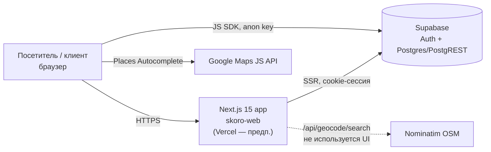
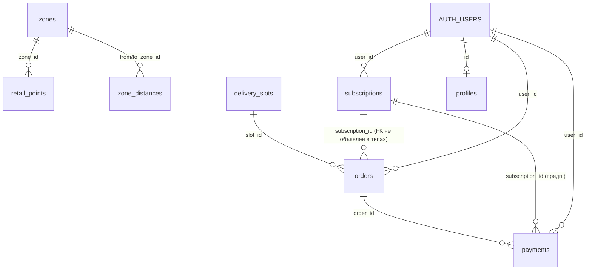

# AS-IS: архитектура Skoro (skoro-web)

> 🗄 **Заменён [CURRENT.md](CURRENT.md) 2026-10-02.** Документ сохранён как историческая реконструкция и больше не обновляется.
>
> ⚠️ **ЧЕРНОВИК — РЕКОНСТРУКЦИЯ ПО КОДУ, ТРЕБУЕТ ПРОВЕРКИ АРХИТЕКТОРОМ.**
> Документ восстановлен 2026-09-29 по ветке `dev` @ `ce1cd21`, без доступа к Supabase, Vercel и авторам.
> **[Факт]** — видно в репозитории. **[Предп.]** — вывод, не подтверждён.
> Текущее состояние работ: [../STATE.md](../STATE.md).

## 1. Контекст системы

- **[Факт]** Один деплоймент Next.js. Отдельного бэкенда нет: бизнес-логика живёт в браузере (калькулятор) и в Postgres (RLS, RPC).
- **[Факт]** Браузер ходит в Supabase напрямую с anon key: калькулятор загружает справочники, форма заказа вызывает RPC.
- **[Предп.]** Хостинг — Vercel (сообщения коммитов, `.vercel` в `.gitignore`). Конфигурации деплоя в репозитории нет.

## 2. Компоненты и слои

| Слой | Где | Что делает | Рендер |
|---|---|---|---|
| Routing / pages | `src/app/**` | App Router: лендинг, `/login`, `/dashboard/*`, route handlers | RSC + client |
| Middleware | `src/middleware.ts` → `lib/supabase/middleware.ts` | Обновление Supabase-сессии на всех путях, кроме статики | Edge/Node |
| Route handlers | `app/auth/callback`, `app/auth/signout`, `app/api/geocode/search` | OAuth/magic-link code exchange, выход, прокси геокодера | Server |
| UI: лендинг | `components/sections/*`, `layout/*`, `ornaments/*` | Маркетинговые секции; контент и цены захардкожены | В основном client |
| UI: калькулятор | `components/calculator/Calculator.tsx`, `googleautocomplete.tsx` | Режимы compare и route, выбор адресов, вывод разбивки | Client |
| UI: ЛК | `components/account/*`, `components/auth/LoginForm.tsx` | Списки заказов и платежей, карточка абонемента, форма заказа, логин | Mixed |
| Domain (чистые функции) | `lib/calculator/pricing.ts`, `surcharges.ts`, `slotpicker.ts`, `units.ts`, `lib/maps/zones.ts` | Формулы цены, доплаты, выбор слота, определение зоны | Isomorphic |
| Data access | `lib/calculator/data.ts` (browser), `lib/account/queries.ts` (server), `lib/account/createOrder.ts` (browser) | Запросы к Supabase | — |
| Infra clients | `lib/supabase/{client,server,middleware}.ts`, `lib/maps/loader.ts` | Фабрики клиентов, загрузка Google Maps | — |
| Types | `src/types/database.ts` | Сгенерированные типы Supabase (`supabase gen types`) | — |

**[Факт]** Зависимости между слоями направлены сверху вниз: UI → lib → infra. Слоя сервисов или use-case нет, UI вызывает data-access напрямую.

## 3. Маршруты

| Путь | Тип | Доступ | Статус |
|---|---|---|---|
| `/` | page | публичный | работает |
| `/login` | page (`(auth)` group) | публичный | работает |
| `/dashboard` | page | auth (редирект в layout) | работает |
| `/dashboard/orders`, `/orders/new` | page | auth | работает |
| `/dashboard/payments` | page | auth | работает |
| `/dashboard/subscribition` | page | auth | работает (опечатка в URL) |
| `/auth/callback` | GET handler | публичный | **[Предп.]** не используется: signup и magic-link в UI нет |
| `/auth/signout` | POST handler | — | работает |
| `/api/geocode/search?q=` | GET handler | публичный | не вызывается UI |
| `/tracking` | — | — | **нет страницы** (удалена), но на неё ведёт HeroTracking |
| `/personal` | — | — | **нет страницы** (пустой `personal.tsx`), но на неё ведёт Navbar |

**[Факт]** Защита `/dashboard` сделана только в `dashboard/layout.tsx` (`getUser()` → `redirect`). Middleware ничего не блокирует, только обновляет сессию.

## 4. Данные

Схема восстановлена **только по `src/types/database.ts`**. Миграций, RLS и SQL функций в репозитории нет.

| Таблица | Назначение | Кто читает / пишет |
|---|---|---|
| `zones` | Зоны Брно (slug: centrum, vnitrni-brno, zapad, vychod, okraj-brna) | калькулятор (browser, anon) |
| `zone_distances` | Матрица км между зонами | калькулятор |
| `retail_points` | Магазины-конкуренты: base_price, per_km_price, delivery_service | калькулятор (compare) |
| `skoro_pricing` | Одна строка: base_price, per_km_price, per_extra_point | калькулятор (compare) |
| `delivery_slots` | Слоты срочности: base_price, max_lead_minutes, label | калькулятор, форма заказа |
| `service_config` | Одна строка: operating_start/end_minute | форма заказа |
| `orders` | Заказы; `status` enum: new / in_progress / delivered / cancelled; `payment_status` text | ЛК: чтение; создание только через RPC |
| `payments` | Платежи (amount, currency, method, status) | ЛК: только чтение |
| `subscriptions` | Абонементы (tier_name, total/remaining_deliveries, status) | ЛК: только чтение |
| `profiles` | Компания клиента (company_name, contact_name, phone) | в UI не используется |

**RPC** `create_order_for_user(p_from_address, p_to_address, p_slot_id, p_scheduled_for, p_recipient_contact, p_comment?) → orders`.
- **[Предп.]** Внутри: определение user_id по `auth.uid()`, расчёт `price`, списание `remaining_deliveries` у активного абонемента, выставление `payment_status`. На это указывает текст UI («Спишется с абонемента…», «ожидает оплаты»). Код функции в репозитории отсутствует.

**Безопасность данных.** **[Предп.]** Изоляция клиентов держится на RLS: `queries.ts` фильтрует не по user_id, а комментирует «RLS уже режет чужие строки». Справочники должны быть читаемы для anon. Всё это требует проверки в Supabase.

## 5. Ключевые потоки

**Калькулятор (публичный).** Весь расчёт на клиенте, сервер Next.js не участвует.
1. Mount → `loadCalculatorData()`: 5 параллельных select в Supabase.
2. Ввод адреса → Google Places Autocomplete (bounds Брно, strict) → lat/lng.
3. `findClosestZone()` по захардкоженным `ZONE_CENTERS` (haversine) → zoneId.
4. `compare()` или `calcRoute()` → разбивка цены.
- Цены доплат и batch — константы в коде (`surcharges.ts`, `BATCH_PER_EXTRA_STOP`), не из БД.

**Вход.** `LoginForm` → `supabase.auth.signInWithPassword` (browser) → cookie → `router.push('/dashboard')`. Middleware обновляет токен на последующих запросах.

**Создание заказа.**
1. `orders/new/page.tsx` (RSC) загружает `delivery_slots`, `service_config` и активный абонемент.
2. `OrderCreateForm` (client) выбирает слот через `pickSlot()` по локальному времени браузера.
3. `createOrder()` → `supabase.rpc('create_order_for_user')` из браузера → редирект на `/dashboard/orders`.
- Адреса в форме заказа — свободный текст, без геокодинга, в отличие от калькулятора.

## 6. Интеграции

| Система | Как | Конфиг | Статус |
|---|---|---|---|
| Supabase Auth + DB | `@supabase/ssr` 0.5.2, `@supabase/supabase-js` 2.x | `NEXT_PUBLIC_SUPABASE_URL`, `NEXT_PUBLIC_SUPABASE_ANON_KEY` | используется |
| Google Maps Places | `@googlemaps/js-api-loader` 2.x, `places` library, language ru, region CZ | `NEXT_PUBLIC_GOOGLE_MAPS_API_KEY` (ключ публичный, **[Предп.]** ограничение по referrer не проверено) | используется в калькуляторе |
| Nominatim (OSM) | server fetch из `/api/geocode/search`, countrycodes=cz, кэш 24 ч и rate-limit в памяти | `NOMINATIM_USER_AGENT` | код есть, UI не использует |
| Google Fonts | `next/font/google` (Oswald, Space Grotesk, Inter; subsets latin) | — | используется |
| Соцсети, телефон | статические ссылки (Instagram, Facebook, `tel:+420…`) | — | — |

Платёжного провайдера, email/SMS, аналитики и мониторинга ошибок в коде нет. **[Факт]**

## 7. Ограничения и технический долг

- **[Факт]** Нет тестов, ESLint, CI, миграций БД, сидов, конфигурации деплоя, `CLAUDE.md` и других docs, кроме этих двух файлов.
- **[Факт]** Бизнес-правила цены разнесены по трём местам: хардкод лендинга, константы TS и таблицы БД. Плюс неизвестная логика в RPC.
- **[Факт]** `Calculator.tsx` (1156 строк) — монолитный client-компонент с ~15 внутренними подкомпонентами.
- **[Факт]** Зоны привязаны к Брно в трёх местах: `BRNO_BOUNDS`, `ZONE_CENTERS` и данные `zones`. Расширение на другие города потребует правок кода. Метаданные при этом обещают «40+ cities».
- **[Факт]** Логика рабочих часов в `pickSlot()` зависит от таймзоны браузера.
- **[Предп.]** In-memory кэш и rate-limit в route handler не работают как глобальные на serverless.
- **[Предп.]** README утверждает, что лендинг работает без Supabase env, но корневой layout вызывает Supabase в `Navbar` на каждом запросе. Не проверено.
- **[Факт]** Мусор в репозитории: `sr` (UTF-16 дамп генерации типов), 2 PNG-макета в корне (~1,7 МБ), неиспользуемые `AddressLookupInput`, `Reviews`, `resolveRecipient`, `getProfile`, пустой `personal.tsx`.

## 8. Что проверить архитектору

1. Реальная схема Supabase: RLS, grants для anon, код `create_order_for_user`, триггеры.
2. Прод-окружение: Vercel-проект, ветка деплоя, env, ограничения Google-ключа.
3. Целевая модель ценообразования и где её считать (клиент, БД или сервер Next).
4. Модель пользователей: B2B (`profiles.company_name`) против B2C (`/personal`), способ регистрации.
5. Нужен ли собственный серверный слой (server actions или API) вместо прямых вызовов Supabase из браузера.
