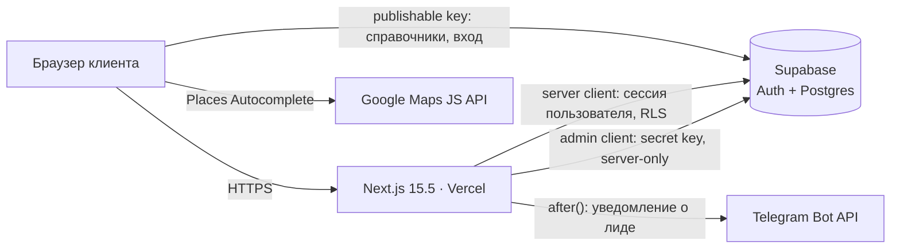

# CURRENT — архитектура Skoro (skoro-web)

> **Источник правды по архитектуре.** Заменяет [AS-IS.md](AS-IS.md), который остаётся как историческая реконструкция.
> Версия от 2026-10-02. Основа: `dev` @ `ce1cd21` + `feature/contact-form` @ `c314e50` (TASK-001), пакет архитектора от 2026-09-30.
> Документ меняет только архитектор. Исполнитель предлагает изменения через [PROPOSALS.md](PROPOSALS.md).
> Текущее состояние работ: [../STATE.md](../STATE.md). Текущая задача: [../TASK.md](../TASK.md).

## 1. Система и границы

Skoro — B2B-курьерская служба в Брно (CZ). Веб-приложение — это одновременно маркетинговый сайт и рабочий инструмент клиента. Состоит из:

- лендинга с калькулятором;
- приёма заявок (лиды);
- личного кабинета: заказы, платежи, абонемент.

В плане — оплата онлайн.

Один деплоймент Next.js на Vercel и один проект Supabase. Отдельного бэкенда нет и не планируется. Серверная логика живёт в Server Actions и Route Handlers Next.js, транзакционная — в функциях Postgres.



Целевое правило (ADR-0003): браузер **не пишет** в Supabase напрямую. Сейчас исключение одно — создание заказа через RPC из браузера, его уберёт TASK-005.

## 2. Принятые решения

| ADR | Решение | Статус |
|---|---|---|
| [0001](adr/0001-branches-and-deploy.md) | `main` — прод, `dev` — интеграция, `feature/*` → PR в `dev`; деплой только через Git-интеграцию Vercel | принято |
| [0002](adr/0002-schema-as-code.md) | Схема БД, RLS и функции — только миграциями в `supabase/migrations/`; baseline делается в TASK-002 | принято |
| [0003](adr/0003-server-write-path.md) | Все записи идут через Server Actions / Route Handlers; три Supabase-клиента со строгими ролями | принято |
| [0004](adr/0004-pricing-single-source.md) | Тарифы хранятся в БД, формула — в одном TS-модуле `lib/pricing`, авторитетная цена считается на сервере | принято, модель данных — после baseline |

**Сквозные правила** (кратко, подробности в ADR):

- **Валидация** — zod, только на сервере. zod не попадает в клиентский бандл: клиентские константы лежат в отдельном `constants.ts`.
- **Ошибки** возвращаются кодами, тексты для пользователя живут в UI. Это задел под i18n.
- **Env** читаются лениво, в момент вызова. Отсутствие серверного ключа ломает фичу, а не рендер страницы или сборку. Серверные ключи — без `NEXT_PUBLIC_`.
- **Бизнес-время** — таймзона `Europe/Prague`, считается на сервере. Таймзона браузера в бизнес-логике не используется.
- **Побочные эффекты** (уведомления, письма) выполняются через `after()` и не влияют на результат основной операции.
- **Юридические тексты** (политика, согласия, оферта) исполнитель пишет и меняет только по прямой команде владельца.

## 3. Слои и модули

| Слой | Где | Правило |
|---|---|---|
| Маршруты | `src/app/**` | RSC по умолчанию. `"use client"` — только для интерактива |
| UI | `src/components/**` | Не ходит в БД сам. Получает данные пропсами или вызывает action |
| Домен | `src/lib/<domain>/` | Чистые функции и actions домена. Зависимости направлены вниз: UI → domain → infra |
| Инфраструктура | `src/lib/supabase/*`, `src/lib/maps/*` | Фабрики клиентов, внешние SDK |
| Типы БД | `src/types/database.ts` | Только генерация (`supabase gen types`), руками не правится |

**Эталон доменного модуля — `src/lib/leads/` (TASK-001).** Новые домены (`pricing`, `orders`, `payments`) строятся по той же схеме:

```
lib/<domain>/
  constants.ts   client-safe константы и типы (без zod)
  schema.ts      zod-схемы, нормализация; server-side
  actions.ts     "use server"; тонкий оркестратор: validate → authorize → persist → after()
  *.ts           чистая логика и доступ к данным
  *.test.ts      vitest на чистые функции
```

**Supabase-клиенты** (ADR-0003):

| Клиент | Ключ | Где разрешён | Назначение |
|---|---|---|---|
| `lib/supabase/client.ts` | publishable (anon) | client components | Публичные справочники, вход и выход |
| `lib/supabase/server.ts` | publishable + cookie-сессия | RSC, actions, route handlers | Всё от имени пользователя, RLS действует |
| `lib/supabase/admin.ts` | secret, `server-only` | actions, route handlers | Системные записи без пользователя (лиды, вебхуки) и внутренние функции **после** явной проверки прав в коде |

## 4. Маршруты

| Путь | Сейчас | План |
|---|---|---|
| `/` | работает; `ƒ` dynamic из-за `Navbar` в корневом layout | `○` static, данные цен через ISR (TASK-003, TASK-004) |
| `/login` | работает | — |
| `/dashboard`, `/orders`, `/payments` | работает; защита в `dashboard/layout.tsx` | — |
| `/dashboard/orders/new` | RPC из браузера, слот по таймзоне браузера | Server Action, Europe/Prague (TASK-005) |
| `/dashboard/subscribition` | работает, опечатка в URL | `/subscription` + редирект со старого (TASK-003) |
| `/auth/callback` | не используется; `next` не проверяется | при возврате регистрации или magic-link принимать только пути с одиночным `/` |
| `/auth/signout` | работает | — |
| `/api/geocode/search` | мёртвый код (Nominatim) | удалить (TASK-002) |
| `/personal` | 404, ссылка в Navbar | убрать ссылку: сейчас только B2B (TASK-003) |
| `/tracking` | 404, форма в HeroTracking | ждёт решения владельца (P-08) |

`middleware.ts` сейчас вызывает `getUser()` на **каждом** запросе, включая лендинг. Целевой matcher (TASK-003): `/dashboard/:path*`, `/login`, `/auth/:path*`.

## 5. Данные

До TASK-002 схема известна только по сгенерированным типам. После TASK-002 источник истины — миграции (ADR-0002). Результаты аудита доступа будут в `db-security.md` (TASK-002).

| Таблица | Назначение |
|---|---|
| `zones`, `zone_distances` | Зоны Брно и матрица расстояний |
| `delivery_slots` | Слоты срочности: цена, запас времени |
| `skoro_pricing` | Базовые ставки (одна строка) |
| `service_config` | Рабочие часы (одна строка) |
| `retail_points` | Данные для режима compare калькулятора |
| `orders`, `payments`, `subscriptions` | Заказы, платежи, абонементы клиента |
| `profiles` | Компания клиента; в UI пока не используется |
| `leads` | Заявки с контактной формы (TASK-001); RLS без политик, права anon и authenticated отозваны |

**Целевая матрица доступа.** Отклонения фиксирует аудит в TASK-002, исправления делаются отдельными миграциями.

| Таблицы | anon | authenticated | Запись |
|---|---|---|---|
| `zones`, `zone_distances`, `delivery_slots`, `skoro_pricing`, `service_config`, `retail_points` | select | select | только миграции и сид |
| `orders`, `payments`, `subscriptions` | — | select **своих** строк | только сервер |
| `profiles` | — | select своей строки | только сервер |
| `leads` | — | — | только сервер (admin) |

Функции с `security definer` обязаны иметь `set search_path = ''`, а `execute` у них отозван для `public`, `anon` и `authenticated`, если прямой вызов из клиента не предусмотрен явно.

## 6. Ключевые потоки

**Лид (эталон, TASK-001).**

1. `ContactForm` вызывает `submitLead` (Server Action).
2. Проверки: honeypot и time-trap → zod → rate-limit по `ip_hash` (через БД).
3. Insert через admin-клиент.
4. `after()` отправляет уведомление в Telegram.

Сбой уведомления лид не теряет. Форма работает и без JS.

**Калькулятор (сейчас).** Справочники читаются из браузера с publishable key. Адрес выбирается через Google Places, зона определяется по ближайшему центру, цена считается на клиенте. После TASK-004 расчёт идёт через `lib/pricing` на данных из БД. На клиенте остаётся только превью.

**Создание заказа.**
- **Сейчас.** `pickSlot()` в браузере → `supabase.rpc('create_order_for_user')` из браузера. Цену и списание абонемента делает RPC; код станет виден после baseline.
- **Цель (TASK-005).**
  1. Server Action: `getUser()` → zod → слот по `Europe/Prague` → цена через `lib/pricing`.
  2. Внутренняя SQL-функция атомарно вставляет заказ и списывает абонемент. Вызывается admin-клиентом, `execute` закрыт для клиентов.
  3. В заказе сохраняется снимок цены: сумма, разбивка, версия тарифа.

**Оплата (цель, TASK-006).** Сумма считается только на сервере. Статус оплаты меняет только вебхук провайдера (Route Handler + admin-клиент + проверка подписи). Провайдер выбирается в TASK-006. Перед этой задачей заводится отдельный staging-проект Supabase (ADR-0002).

## 7. Интеграции

| Система | Назначение | Конфиг | Статус |
|---|---|---|---|
| Supabase | Auth, Postgres | `NEXT_PUBLIC_SUPABASE_URL`, `NEXT_PUBLIC_SUPABASE_ANON_KEY` (publishable), `SUPABASE_SECRET_KEY` | используется |
| Google Maps Places | Ввод адресов в калькуляторе; **единственный геокодер** (P-09) | `NEXT_PUBLIC_GOOGLE_MAPS_API_KEY` — обязательно ограничить по HTTP referrer | используется |
| Telegram Bot API | Уведомления о лидах | `TELEGRAM_BOT_TOKEN`, `TELEGRAM_CHAT_ID` | TASK-001 |
| Антиспам лидов | Хэширование IP | `LEAD_IP_SALT` | TASK-001 |
| Nominatim | — | `NOMINATIM_USER_AGENT` | удаляется (TASK-002) |
| Google Fonts | `next/font` | — | у Space Grotesk нет кириллицы (бэклог, дизайн) |

## 8. Платформа и окружения

| Что | Решение |
|---|---|
| Node | 22 LTS: `engines >=22.12`, `.nvmrc` = `22`, Vercel 22.x. Node 22 EOL 2027-04-30 → переход на 24 LTS до этой даты (бэклог) |
| Next.js | 15.5.x с актуальными патчами (на 2026-10-02 — 15.5.27). Next 16 — отдельная задача миграции (бэклог), не смешивать с фичами |
| Ветки и деплой | ADR-0001 |
| Supabase | Один проект до TASK-006. Перед оплатой — отдельный staging-проект (ADR-0002) |
| Качество | `tsc --noEmit`, `eslint .`, `vitest`, `next build` в CI на каждый PR (TASK-002) |

## 9. Известные проблемы и где они решаются

| Проблема | Где |
|---|---|
| Схема, RLS и RPC не в репозитории | TASK-002 |
| Google Autocomplete пересоздаётся на каждый рендер: `onSelect` inline в deps эффекта → утечка `.pac-container`, сброс сессий Places | TASK-002 |
| Time-trap сравнивает часы клиента с серверными (P-10) | TASK-002 |
| Мёртвый код, мусор в git, нетипизированные клиенты Supabase | TASK-002 |
| Лендинг dynamic, middleware на каждом запросе, битые `/personal` и опечатка `subscribition` | TASK-003 |
| Цены в трёх местах, `BATCH_PER_EXTRA_STOP` дважды, монолитный `Calculator.tsx` (дробится по необходимости) | TASK-004 |
| `pickSlot` по таймзоне браузера; `serviceRes.data!`; `.maybeSingle()` при нескольких активных абонементах (нужен частичный unique index) | TASK-005 |
| `<html lang="en">`, метаданные «40+ cities», хардкод Брно в трёх местах | бэклог (контент, i18n, расширение географии) |

## 10. Дорожная карта

0. **Закрыть TASK-001.** Откатить Next 16, поставить патч 15.5.x, `npm test` + `build`, заполнить env, пройти ручной чек-лист, влить в `dev`.
1. **TASK-002 — фундамент.** Baseline схемы и аудит доступа, Node и патчи, ESLint и CI, гигиена, два мелких дефекта.
2. **TASK-003 — статический лендинг и навигация.** Navbar без сессии на сервере, matcher middleware, `/personal`, `/subscription`.
3. **TASK-004 — единый источник цен** (ADR-0004).
4. **TASK-005 — создание заказа на сервере** (ADR-0003).
5. **TASK-006 — гейт оплаты.** Staging, выбор провайдера, вебхуки.

**Бэклог:**
- подписка в Footer (по паттерну leads);
- регистрация и онбординг B2B;
- трекинг (после решения P-08);
- миграция на Next 16;
- Node 24;
- `@supabase/ssr` до актуальной 0.x;
- i18n (cs/en/ru);
- шрифт с кириллицей.

## 11. Журнал решений по PROPOSALS (2026-10-02)

| # | Решение |
|---|---|
| P-01 | ADR-0001. `main` создаётся от `ec05ede` (это содержимое живого сайта, проверено архитектором), тег `prod-2026-05-17`. `master` и `variant1` удаляются после переключения Vercel |
| P-02 | ADR-0002. Baseline в TASK-002: `link` → `migration repair` (leads) → `db pull`. Staging — перед TASK-006 |
| P-03 | Node 22 LTS в трёх местах (TASK-002); переход на 24 — до 2027-04 |
| P-04 | Остаёмся на 15.5.x: откат незакоммиченного Next 16, `npm audit fix` без `--force`. Next 16 — бэклог |
| P-05 | ADR-0003. Все записи через сервер; `createOrder` → Server Action (TASK-005) |
| P-06 | Navbar статичный; статус входа — клиентский островок на browser-клиенте (UI-индикация, не защита). Защита остаётся в `dashboard/layout.tsx`. Matcher middleware сужается. TASK-003 |
| P-07 | ADR-0004 |
| P-08 | Сейчас только B2B. Аккаунты создаёт владелец в Supabase до задачи онбординга. Ссылку `/personal` убрать (TASK-003). **Трекинг — ждёт решения владельца** |
| P-09 | Google Places — единственный геокодер; Nominatim удалить (TASK-002) |
| P-10 | Вместо абсолютной метки — длительность заполнения по часам клиента: `elapsedMs` = submit − mount, оба значения на одном устройстве. HMAC не нужен, со статическим лендингом совместимо (TASK-002) |
| P-11 | ESLint 9 (flat config, `eslint-config-next` 15.5.x), скрипт `eslint .` (`next lint` устарел); GitHub Actions на PR (TASK-002) |
| P-12 | Принято целиком (TASK-002) |
